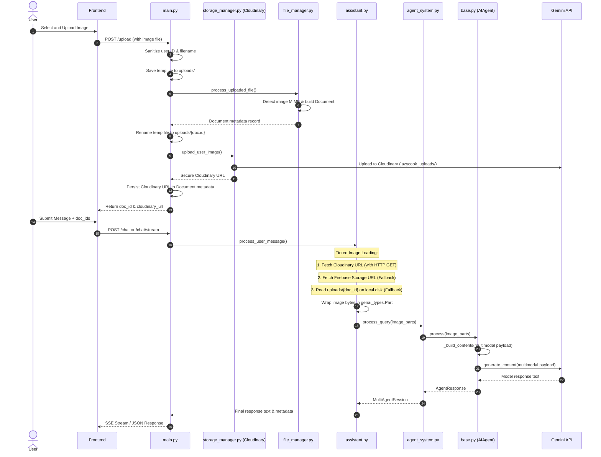

# Image Processing Workflow in LazyCook

This document provides a comprehensive explanation of how image files are uploaded, stored, loaded, processed, and sent to the multimodal Gemini model within the LazyCook project.

---

## Architecture Overview

The image processing system is designed to handle user uploads reliably, ensuring images are stored persistently in the cloud, cached locally on disk for same-session speed, and loaded using a robust tiered fallback structure.



---

## Detailed Step-by-Step Workflow

### 1. Upload & Ingestion Phase
When a user uploads an image in the chat interface:
1. **Endpoint Triggered**: The frontend calls the `POST /upload` endpoint in [lazycook/main.py](file:///d:/AlphaKore/Lazycook/lazy-cook_terminal/lazycook/main.py#L614).
2. **Path Sanitization**: The endpoint sanitizes both `user_id` and the `filename` to prevent path traversal vulnerability (removing characters other than alphanumeric/hyphens/underscores).
3. **Temporary Storage**: The raw file is saved to the local `uploads/` directory with a unique timestamped name.
4. **MIME Detection & Verification**: The API calls `process_uploaded_file()` in [lazycook/core/file_manager.py](file:///d:/AlphaKore/Lazycook/lazy-cook_terminal/lazycook/core/file_manager.py#L255):
   - Mimetype guessing matches standard image formats (`image/png`, `image/jpeg`, `image/jpg`, `image/gif`, `image/webp`, `image/bmp`, `image/tiff`) or detects scanned, textless PDFs (which are flagged to use vision processing fallback).
   - A `Document` database model is constructed, containing details like file type, size, upload time, user ID, MD5 hash value, and a placeholder content string `[Image: filename]`.
5. **Disk Preservation**: In [main.py](file:///d:/AlphaKore/Lazycook/lazy-cook_terminal/lazycook/main.py#L659), since image bytes cannot be stored directly in Firestore due to size constraints, the temporary file is renamed and persisted at a stable disk path: `uploads/{doc_id}`.
6. **Cloudinary Upload**: To ensure persistence across container/server restarts, the local file is uploaded to Cloudinary by calling `upload_user_image()` in [lazycook/utils/storage_manager.py](file:///d:/AlphaKore/Lazycook/lazy-cook_terminal/lazycook/utils/storage_manager.py#L53). It is stored in the `lazycook_uploads` folder with a public ID mapping to the document ID (`img_{doc_id}`).
7. **Metadata Persistence**: The resulting secure Cloudinary URL is added to the document's metadata (`image_cloudinary_url`). The updated document metadata is saved to Firestore or the local JSON file database.

---

### 2. Chat Request & Thread Context Loading
When a user sends a prompt that includes the uploaded image:
1. **Endpoint Action**: The user sends a request to `POST /chat` or `POST /chat/stream` in [main.py](file:///d:/AlphaKore/Lazycook/lazy-cook_terminal/lazycook/main.py#L409), providing the target `doc_ids`.
2. **Context Assembly**: The API delegates processing to `process_user_message()` in [lazycook/core/assistant.py](file:///d:/AlphaKore/Lazycook/lazy-cook_terminal/lazycook/core/assistant.py#L53).
3. **Retrieving Effective Documents**: If no documents are sent with the current query, the assistant loads previously accumulated document IDs from the Firestore thread context so that images uploaded in earlier messages remain in memory.

---

### 3. Tiered Multimodal loading (Robust Image Recovery)
In [lazycook/core/assistant.py](file:///d:/AlphaKore/Lazycook/lazy-cook_terminal/lazycook/core/assistant.py#L120), if a document ID represents an image, the system initiates a **tiered loading sequence** to retrieve its raw bytes:

| Tier | Source | Logic / Description |
| :--- | :--- | :--- |
| **Tier 1** | **Cloudinary URL** | Hits the public secure Cloudinary URL via an HTTP GET request with a 15-second timeout. This is the primary persistent path. |
| **Tier 1b** | **Firebase Storage URL** | If Cloudinary is not configured or fails, it tries fetching the public URL from Firebase Storage. |
| **Tier 2** | **Local Disk** | If both cloud fetch attempts fail, it reads raw bytes directly from the local disk at `uploads/{doc_id}` (useful for same-session uploads if disk is not wiped). |

* **Loading Failure Handling**: If the image cannot be retrieved through any tier, the assistant appends a warning block (`=== IMAGE UNAVAILABLE ===`) to the textual context. This instructs the AI generator to inform the user that their image could not be loaded and ask them to re-upload it, avoiding hallucinations.
* **SDK Wrap**: If bytes are successfully retrieved, they are wrapped into a Google GenAI SDK multimodal object: `genai_types.Part.from_bytes(data=img_bytes, mime_type=img_mime)` and stored in `image_parts`.

---

### 4. Agent Pipeline Routing & Bypasses
The query is dispatched to `process_query()` in [lazycook/core/agent_system.py](file:///d:/AlphaKore/Lazycook/lazy-cook_terminal/lazycook/core/agent_system.py#L341):
* **Greeting / Conversational Bypass Block**: Conversational fast-paths (which normally skip the main generator/optimizer cycle to reply quickly, e.g. "hi", "how are you") are explicitly disabled when images are attached. This ensures that the image is not ignored if a user says "hi" while attaching a photo.
* **Web Search Skip**: Direct upfront web grounding and searches are bypassed for image-query operations to prevent unrelated keyword searching (e.g. searching Serper for a query like "what is in this?").

---

### 5. Multimodal API Call Execution
The core prompt construction and model invocation occurs inside `AIAgent._generate_solution` in [lazycook/agents/base.py](file:///d:/AlphaKore/Lazycook/lazy-cook_terminal/lazycook/agents/base.py#L262):
1. **Vision Instruction Injection**: If `image_parts` are present, the agent injects a prompt block:
   ```text
   🖼️ IMAGE INPUT: The user has attached one or more images above. Carefully examine each image and incorporate your visual analysis into your response.
   ```
2. **Payload Building**: Using `_build_contents()`, it joins the list of image parts with the text prompt part:
   ```python
   image_parts + [genai_types.Part.from_text(text=prompt)]
   ```
3. **API Request**: The combined multimodal contents array is passed to Gemini using `google-genai`'s asynchronous client: `self.client.aio.models.generate_content(...)`.
4. **Fallback mechanism**: If the target model rejects the multimodal payload (raising `INVALID_ARGUMENT`, `MULTIMODAL`, `IMAGE`, `VISION`, or `UNSUPPORTED`), the agent catches the error, sets `active_image_parts = None`, and retries the call with a text-only prompt. It prepends a warning to the response: `> ⚠️ I couldn't read the attached image with the current model, so this answer is based on your text only...` to maintain user awareness of the degradation.

---

### 6. Downstream Agent Processing
Only the initial `Generator` agent receives the raw image parts. Downstream agents (such as the `Analyzer`, `Optimizer`, and `Validator`) process the text prompt, the conversation context, and the Generator's text output rather than the raw image bytes. This prevents downstream API requests from ballooning in latency and token footprint.

---

### 7. Cleanup & Deletion
If a user removes an image chip or discards an attachment:
1. **Endpoint**: The client invokes `DELETE /upload/{doc_id}` in [main.py](file:///d:/AlphaKore/Lazycook/lazy-cook_terminal/lazycook/main.py#L697).
2. **Firestore Deletion**: The Firestore record is removed.
3. **Cloudinary Deletion**: The assistant commands Cloudinary to destroy the asset under the path `lazycook_uploads/img_{doc_id}`:
   ```python
   cloudinary.uploader.destroy("lazycook_uploads/img_" + doc_id, resource_type="image", invalidate=True)
   ```
4. **Local Disk Purge**: The local file at `uploads/{doc_id}` is deleted from disk.
